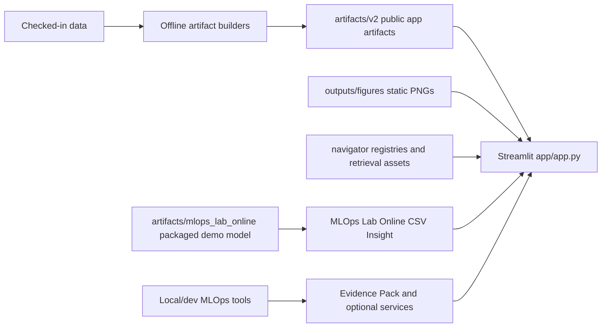
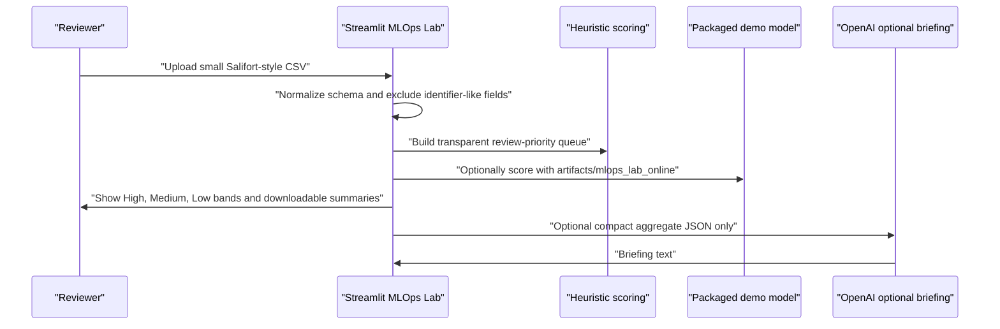
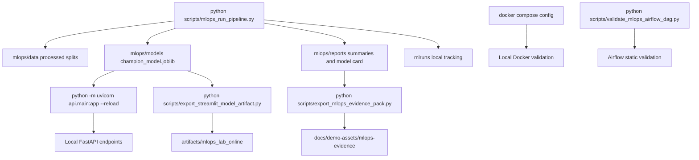

# Technical Design and Architecture

## Document Purpose

This document explains how the **Salifort Motors Retention Risk Explorer** is structured and how its main technical layers work together.

It combines system architecture and technical design into one file because the current repo does not need separate architecture and technical-design documents. A single document is easier to maintain and avoids repeating the same runtime and design details in multiple places.

## System Positioning

This repository is a Streamlit portfolio app with a layered local-file architecture. It is not a production HR platform, a live inference API service, or a workflow execution system.

The design separates:

- **offline build and validation work**
- **Streamlit runtime presentation**
- **advanced reviewer metadata and retrieval support**
- **optional local/dev MLOps Mini-Lab tooling**

That separation is one of the main technical truths of the repo.

## High-Level Architecture



The hosted Streamlit app reads committed files and renders review surfaces. It does not train, start services, trigger workflows, or mutate project artifacts during a visitor session.

### 1. App runtime layer

Located mainly in:

- `app/app.py`
- `app/pages/`
- `app/utils/load_data.py`
- `app/viewmodels/`

Responsibilities:

- register Streamlit pages
- load checked-in data and generated artifacts
- render charts, tables, page guidance, and advanced reviewer surfaces
- keep runtime behavior read-only

### 2. Generated artifact layer

Located mainly in:

- `artifacts/v2/`
- `outputs/figures/`

Responsibilities:

- provide model metadata, threshold tables, exposure summaries, row-level scores, and SHAP summaries
- provide stable presentation figures
- keep app runtime lightweight by avoiding model retraining during a visitor session

### 3. Navigator metadata and reviewer layer

Located mainly in:

- `navigator/`
- `app/services/`
- `app/viewmodels/navigator_read_model.py`
- `app/pages/pace_navigator.py`

Responsibilities:

- preserve explicit truth, drift, phase, glossary, workflow, and readiness metadata
- provide governed retrieval-backed review tools
- assemble deterministic citation-backed answers for fixed review questions
- expose evidence, source preview eligibility, workflow contracts, and preview-only plan surfaces

### 4. Offline build and validation layer

Located mainly in:

- `scripts/build_v2_artifacts.py`
- `scripts/build_retrieval_pack.py`
- `scripts/build_retrieval_index.py`
- `scripts/validate_*.py`

Responsibilities:

- generate runtime artifacts
- build retrieval assets
- validate contracts and advanced reviewer surfaces
- keep those responsibilities outside the Streamlit session

### 5. Optional MLOps Mini-Lab layer

Located mainly in:

- `src/salifort_mlops/`
- `scripts/mlops_*.py`
- `api/`
- `mlops/`
- `artifacts/mlops_lab_online/`
- `docker/`
- `orchestration/airflow/dags/salifort_mlops_pipeline.py`
- `.github/workflows/ci.yml`

Responsibilities:

- refactor the original workflow into reusable local/dev modules
- prepare lab data splits, train lab-only candidates, and write local reports
- serve the lab champion through an optional FastAPI service when local model artifacts exist
- support hosted Streamlit inference with a committed, packaged MLOps Lab demo model artifact
- provide Docker Compose, Airflow DAG, and CI validation surfaces for technical review
- keep lab outputs and packaged demo artifacts separate from the public `artifacts/v2/` app truth

## Repository Flow

### Runtime flow

1. `app/app.py` starts the Streamlit app and registers all pages.
2. Pages use `app/utils/load_data.py` to load the checked-in CSV, detect artifact availability, and expose runtime mode information.
3. Pages prefer generated artifacts in `artifacts/v2/` when they exist.
4. Static figures in `outputs/figures/` support EDA, storytelling, and fallback visuals.
5. PACE Navigator builds advanced review context through `app/viewmodels/navigator_read_model.py` and the service layer under `app/services/`.
6. MLOps Lab reads static evidence, optional local status files, and the packaged online demo model artifact without calling external scoring services in hosted mode.

### Offline flow

1. `scripts/build_v2_artifacts.py` prepares the public runtime artifact set.
2. `scripts/build_retrieval_pack.py` creates governed documents and chunks for retrieval.
3. `scripts/build_retrieval_index.py` creates the local embedding index for retrieval-backed review.
4. Validation scripts confirm that registries, retrieval assets, answer assembly, readiness, and review boundaries remain consistent.

## Key Runtime Truths

### Public model truth

The public reference model remains:

- **Weighted XGBoost**
- **selected threshold: `0.29`**

This truth is preserved in the generated metadata and supporting docs even though local reruns may produce a different metric leader.

### MLOps Lab packaged demo truth

The hosted MLOps Lab packaged model is separate:

- artifact folder: `artifacts/mlops_lab_online/`
- model scope: `mlops-lab-online-demo`
- current lab threshold: `0.60`
- source: exported from the local/dev MLOps Mini-Lab champion

This model enables Streamlit-native hosted inference for the Online CSV Insight sandbox. It does not replace the public Weighted XGBoost threshold `0.29` story in `artifacts/v2/`.

### Artifact-backed runtime truth

The app should use generated artifacts when they are available. It should not recreate model outputs, retrain models, or infer metrics from static images during a visitor session.

### Fallback separation

Some pages can fall back to a simpler screening view if row-level generated artifacts are missing. That fallback exists to keep the demo explorable, but it must remain clearly separate from final model probability truth.

## Data and Artifact Design

### Checked-in dataset

- File: `data/hr_capstone_dataset.csv`
- Role: reproducible portfolio/demo dataset
- Loader: `app/utils/load_data.py`

The loader standardizes columns, removes duplicates, derives helper fields, and creates a stable row identifier for artifact joins.

### Generated artifacts

Main examples in `artifacts/v2/`:

- `metadata.json`
- `employee_scores.parquet`
- `department_exposure.csv`
- `threshold_curve.csv`
- `validation_model_comparison.csv`
- `confusion_matrix_at_selected_threshold.csv`
- `shap_importance.csv`

Optional examples:

- `employee_shap_sample.parquet`
- `pr_curve_points.parquet`
- `model_modes_summary.json`

The artifact contract lives in `artifacts/v2/schemas/artifact_contract.json`.

### Static figure layer

The app also uses stable PNG figures under `outputs/figures/` for EDA, validation, threshold, and explainability storytelling. These are presentation assets, not the main structured truth when generated tables exist.

## Streamlit Page Roles

### Main portfolio pages

- `overview.py`: landing page and project framing
- `workforce_explorer.py`: interactive workforce and department review
- `eda_patterns.py`: stable supporting visuals
- `model_threshold_lab.py`: model comparison and threshold explanation
- `explainability.py`: SHAP-based model explanation
- `manager_action_view.py`: department exposure and practical review framing
- `methods_limitations.py`: architecture, limits, and responsible-use explanation

### Advanced reviewer page

- `pace_navigator.py`: guided project map plus optional advanced governed review tools
- `mlops_lab.py`: hosted Online CSV Insight, packaged demo model inference, MLOps Evidence Pack, and read-only local/dev MLOps status for pipeline artifacts, API status, Docker, Airflow, and CI

## MLOps Mini-Lab Extension

The MLOps Mini-Lab is a technical portfolio extension. It has three complementary surfaces:

- **Hosted Streamlit demo:** Online CSV Insight supports CSV upload, transparent heuristic review scoring, packaged demo model inference from `artifacts/mlops_lab_online/`, and optional aggregate-only OpenAI briefings.
- **MLOps Evidence Pack:** committed, sanitized snapshots under `docs/demo-assets/mlops-evidence/` let online reviewers inspect local/dev implementation proof without running the user's computer.
- **Local/dev implementation:** CLI data prep and training, MLflow tracking, FastAPI serving, Docker Compose, Airflow DAG scaffolding, and GitHub Actions checks demonstrate MLOps/DevOps mechanics outside Streamlit runtime.

The MLOps lab is intentionally separate from the artifact-backed public app:

- Streamlit does not trigger lab training or orchestration.
- FastAPI, Docker, MLflow, and Airflow are optional local/dev tools.
- Generated lab outputs live under `mlops/` and `mlruns/` and are gitignored.
- The lab champion and lab threshold may differ from the public model story.
- The public app truth remains Weighted XGBoost at threshold `0.29` unless a separate governed artifact update changes it.

### Hosted Online CSV Insight flow



The upload is read in memory. The sandbox caps upload size, validates required fields, keeps `uploaded_row_id` as a session-only review index, and does not write uploaded CSVs to the repository.

### Packaged model inference contract

The packaged model path:

1. loads `artifacts/mlops_lab_online/model_metadata.json`
2. loads `artifacts/mlops_lab_online/champion_model.joblib` through `joblib`
3. prepares the uploaded rows with `src/salifort_mlops/predict.py`
4. calls `predict_proba`
5. applies the lab threshold from metadata, currently `0.60`
6. returns review-support probabilities, High/Medium/Low bands, and download columns

The path runs inside Streamlit and does not require `SALIFORT_API_URL`, `SALIFORT_API_TOKEN`, Render, FastAPI, Docker, MLflow, or Airflow.

### Local/dev MLOps flow



Generated local/dev outputs under `mlops/data`, `mlops/models`, `mlops/reports`, and `mlruns/` are not required for hosted Streamlit and should remain gitignored except for intentionally exported sanitized evidence.

## PACE Navigator Technical Design

PACE in this repo is mainly a workflow framing system: **Plan, Analyze, Construct, Execute**. It helps organize the project and its advanced review surfaces.

### Core registry files

Under `navigator/`:

- `source_registry.yaml`
- `truth_registry.json`
- `drift_register.json`
- `pace_phase_map.json`
- `glossary.json`

These make project claims inspectable instead of leaving them buried in page copy.

### Retrieval-backed review design

Retrieval is based on:

- governed documents and chunks under `navigator/retrieval_pack/`
- local embedding index assets under `navigator/retrieval_index/`
- retrieval/query logic in `app/services/navigator_retriever.py`
- deterministic answer assembly in `app/services/navigator_answer_assembly.py`

The retrieval flow is fixed-question and review-oriented:

1. the reviewer selects a fixed question and retrieval depth
2. the app embeds the fixed query through the OpenAI API if the user has supplied a local key
3. the query is matched against the local chunk vector index
4. the answer-assembly layer returns a structured answer with citations, evidence, caveats, and coverage

This is not a chatbot and not free-form generation.

### OpenAI API role

The OpenAI API is used proportionally:

- to build embeddings for the local retrieval index
- to embed fixed reviewer queries for retrieval
- to generate an optional MLOps Lab briefing from compact aggregate JSON only

The app does not store API keys in the repo. Retrieval-backed review depends on environment variables such as `RAG_STREAMLIT_OPENAI_API_KEY` or `OPENAI_API_KEY`. The hosted MLOps Lab aggregate briefing uses `OPENAI_API_KEY` and optional `OPENAI_SUMMARY_MODEL`.

Privacy boundary: raw uploaded CSV rows and identifier-like fields are not sent to OpenAI. The MLOps Lab prompt receives compact aggregate counts, top drivers, department summaries, and responsible-use caveats only.

### Source preview and evidence design

PACE Navigator can also show:

- citations
- source detail
- evidence traces
- governed source preview eligibility for small, safe text-like files

This keeps review evidence inspectable without turning the app into a general repo browser.

## Workflow Contracts, Airflow, and Agent Shell

### Workflow contracts

The repo defines explicit workflow and task contracts under `navigator/orchestration/`. These describe build, validation, audit, and review units without executing them from Streamlit.

### Airflow scaffold

The Airflow file under `orchestration/airflow/dags/` is a safe scaffold that models workflow structure. It is not evidence that Streamlit runs Airflow jobs or that a production scheduler is active.

### Agent shell

The PACE agent shell is a controlled, preview-only planning surface:

- it maps fixed request types to known workflows and pages
- it shows blockers, inputs, and expected outputs
- it does not run jobs or act autonomously

## Deployment Design

### Local app runtime

Recommended startup:

```bash
pip install -r requirements.txt
streamlit run app/app.py
```

### Optional advanced reviewer setup

Advanced retrieval-backed reviewer features may require:

- an OpenAI API key in local environment variables
- a built retrieval pack
- a built retrieval index

### Community Cloud posture

The repo is designed to be deployable as a public portfolio app on Streamlit Community Cloud using `app/app.py` as the entry point. Hosted Streamlit uses `requirements.txt`; `requirements-mlops.txt`, FastAPI, Docker Compose, MLflow, and Airflow are local/dev extension tools.

## Technical Boundaries

The current repo should not be described as:

- a live HR monitoring platform
- a production workflow system
- a production Airflow deployment
- an autonomous multi-agent application
- a hosted FastAPI scoring platform
- a system that sends raw CSV rows or PII to OpenAI
- a production employment decision system

The accurate description is:

- a portfolio/demo decision-support app
- with artifact-backed runtime behavior
- plus optional advanced reviewer tooling for retrieval, citations, workflow inspection, and readiness review

## Related Documents

- [Root README](../../README.md)
- [Documentation Guide](../README.md)
- [Environment Setup and Deployment Guide](../deployment/environment-setup-and-deployment-guide.md)
- [User Manual](../user-guide/user-manual.md)
- [Streamlit App Walkthrough](../user-guide/streamlit-app-walkthrough.md)
- [Navigator Notes](../navigator/README.md)
- [MLOps Mini-Lab Demo Guide](../mlops-demo-guide.md)
- [Formal Documentation Package](../formal/salifort-formal-document-package.md)
